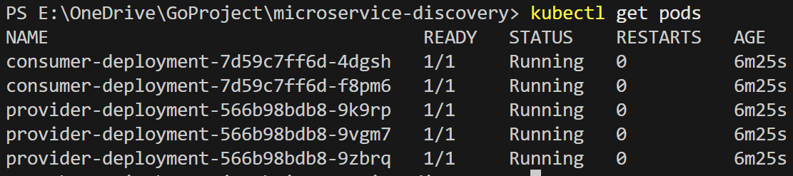
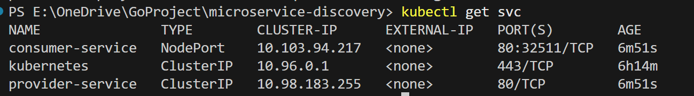
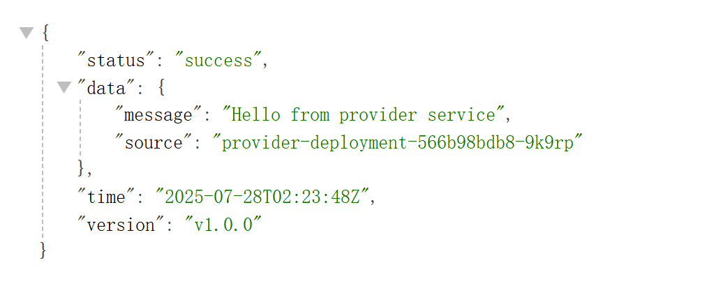

# 微服务发现项目 (Microservice Discovery)

这是一个基于 Go 语言开发的微服务架构示例项目，演示了服务发现、负载均衡、容器化部署以及 Kubernetes 集群部署的完整流程。项目包含服务提供者（Provider）、服务消费者（Consumer）两个微服务，通过 Docker 和 Kubernetes 实现服务编排和发现。

## 目录
- [结果图](#结果图)
- [项目概述](#项目概述)
- [技术栈](#技术栈)
- [项目架构](#项目架构)
- [目录结构](#目录结构)
- [核心概念](#核心概念)
- [服务详解](#服务详解)
- [部署方式](#部署方式)
- [API 接口](#api-接口)
- [监控与健康检查](#监控与健康检查)
- [故障排查](#故障排查)

# 结果图






## 项目概述

本项目是一个微服务架构的实战案例，主要特点：
- **服务发现**：通过 Kubernetes Service 实现自动服务发现
- **负载均衡**：Kubernetes 内置负载均衡功能
- **健康检查**：完整的健康检查和存活探针配置
- **容器化**：使用 Docker 多阶段构建优化镜像大小
- **云原生**：支持 Kubernetes 集群部署
- **高可用**：多实例部署，自动故障恢复

## 技术栈

### 后端技术
- **Go 1.24.1**: 主要开发语言
- **net/http**: Go 标准库 HTTP 服务器
- **encoding/json**: JSON 数据处理

### 容器化技术
- **Docker**: 容器化平台
- **Docker Compose**: 本地开发环境编排
- **Alpine Linux**: 轻量级基础镜像

### 云原生技术
- **Kubernetes**: 容器编排平台
- **Service**: 服务发现与负载均衡
- **Deployment**: 应用部署管理
- **Ingress**: 集群外部访问入口
- **ConfigMap**: 配置管理
- **Health Probes**: 健康检查机制

## 项目架构

```
┌─────────────────┐    HTTP请求     ┌─────────────────┐
│   外部用户      │ ──────────────→ │   Kubernetes     │
│                 │                  │   Ingress        │
└─────────────────┘                  └─────────────────┘
                                              │
                                              ▼
┌─────────────────────────────────────────────────────────┐
│                  Kubernetes 集群                        │
│                                                         │
│  ┌─────────────────┐    服务调用    ┌─────────────────┐ │
│  │  Consumer       │ ──────────────→ │   Provider      │ │
│  │  Service        │                 │   Service       │ │
│  │  (2 replicas)   │                 │   (3 replicas)  │ │
│  │                 │                 │                 │ │
│  │ ┌─────────────┐ │                 │ ┌─────────────┐ │ │
│  │ │ Pod 1       │ │                 │ │ Pod 1       │ │ │
│  │ │ :8081       │ │                 │ │ :8080       │ │ │
│  │ └─────────────┘ │                 │ └─────────────┘ │ │
│  │ ┌─────────────┐ │                 │ ┌─────────────┐ │ │
│  │ │ Pod 2       │ │                 │ │ Pod 2       │ │ │
│  │ │ :8081       │ │                 │ │ :8080       │ │ │
│  │ └─────────────┘ │                 │ └─────────────┘ │ │
│  └─────────────────┘                 │ ┌─────────────┐ │ │
│                                      │ │ Pod 3       │ │ │
│                                      │ │ :8080       │ │ │
│                                      │ └─────────────┘ │ │
│                                      └─────────────────┘ │
└─────────────────────────────────────────────────────────┘
```

## 目录结构

```
microservice-discovery/
├── docker-compose.yml          # Docker Compose 编排文件
├── README.md                   # 项目文档
├── consumer/                   # 服务消费者
│   ├── Dockerfile             # 消费者 Docker 镜像构建文件
│   ├── go.mod                 # Go 模块依赖文件
│   └── main.go                # 消费者服务主程序
├── provider/                   # 服务提供者
│   ├── Dockerfile             # 提供者 Docker 镜像构建文件
│   ├── go.mod                 # Go 模块依赖文件
│   └── main.go                # 提供者服务主程序
└── k8s/                       # Kubernetes 部署配置
    ├── deployment.yaml        # 服务部署配置
    └── ingress.yaml           # 集群入口配置
```

## 核心概念

### 1. 服务发现 (Service Discovery)
服务发现是微服务架构中的核心概念，允许服务在运行时动态发现和连接到其他服务。

**实现方式：**
- **Kubernetes Service**: 通过 Service 资源提供稳定的网络端点
- **DNS 解析**: 服务名自动解析为 Service 的 ClusterIP
- **环境变量**: 通过环境变量传递服务地址信息

### 2. 负载均衡 (Load Balancing)
Kubernetes Service 自动为后端 Pod 提供负载均衡功能。

**负载均衡策略：**
- **轮询**: 默认策略，请求依次分发到各个 Pod
- **会话保持**: 可通过 Service 配置实现会话亲和性

### 3. 健康检查 (Health Checks)
确保服务的可用性和稳定性。

**检查类型：**
- **Liveness Probe**: 存活探针，检查容器是否正常运行
- **Readiness Probe**: 就绪探针，检查容器是否准备好接收流量

## 服务详解

### Provider 服务（服务提供者）

**职责：**
- 提供数据服务接口
- 暴露服务信息
- 响应健康检查请求

**核心功能：**
```go
// 服务信息结构体
type ServiceInfo struct {
    ServiceName string `json:"service_name"`
    Host        string `json:"host"`
    Port        string `json:"port"`
    Version     string `json:"version"`
}
```

**主要接口：**
- `GET /info`: 获取服务基本信息
- `GET /data`: 获取业务数据
- `GET /health`: 健康检查接口

**环境变量配置：**
- `PORT`: 服务监听端口（默认：8080）
- `ENVIRONMENT`: 运行环境
- `LOG_LEVEL`: 日志级别

### Consumer 服务（服务消费者）

**职责：**
- 调用 Provider 服务获取数据
- 聚合和处理业务逻辑
- 对外提供统一接口

**核心功能：**
```go
// 消费者响应结构
type ConsumerResponse struct {
    Status  string       `json:"status"`
    Data    ProviderData `json:"data"`
    Time    string       `json:"time"`
    Version string       `json:"version"`
}
```

**主要接口：**
- `GET /fetch`: 获取聚合数据
- `GET /health`: 健康检查接口

**环境变量配置：**
- `PORT`: 服务监听端口（默认：8081）
- `PROVIDER_SERVICE`: Provider 服务地址
- `ENVIRONMENT`: 运行环境
- `LOG_LEVEL`: 日志级别

## 部署方式

### 1. Docker Compose 本地部署

**优势：**
- 快速本地开发和测试
- 简单的服务编排
- 适合开发环境

**部署步骤：**
```bash
# 1. 构建并启动所有服务
docker-compose up --build

# 2. 后台运行
docker-compose up -d

# 3. 查看服务状态
docker-compose ps

# 4. 查看日志
docker-compose logs -f

# 5. 停止服务
docker-compose down
```

**服务访问地址：**
- Provider: http://localhost:8080
- Consumer: http://localhost:8081

### 2. Kubernetes 集群部署

**优势：**
- 生产级别的容器编排
- 自动服务发现和负载均衡
- 高可用和自动故障恢复
- 水平扩展能力

**部署前准备：**
```bash
# 1. 构建服务镜像
cd provider
docker build -t service-provider:v1 .

cd ../consumer
docker build -t service-consumer:v1 .

# 2. 确保 Kubernetes 集群运行正常
kubectl cluster-info
```

**部署步骤：**
```bash
# 1. 部署服务
kubectl apply -f k8s/deployment.yaml

# 2. 部署 Ingress（可选）
kubectl apply -f k8s/ingress.yaml

# 3. 查看部署状态
kubectl get deployments
kubectl get services
kubectl get pods

# 4. 查看服务日志
kubectl logs -f deployment/provider-deployment
kubectl logs -f deployment/consumer-deployment
```

**访问服务：**
```bash
# 通过 NodePort 访问
kubectl get svc consumer-service
# 访问地址：http://<node-ip>:<node-port>

# 通过 Ingress 访问（如果配置了域名）
# Consumer: http://microservice.local/consumer/fetch
# Provider: http://microservice.local/provider/data
```

## API 接口

### Provider 服务接口

#### 获取服务信息
```http
GET /info
```

**响应示例：**
```json
{
  "service_name": "data-provider",
  "host": "provider-deployment-xxx",
  "port": "8080",
  "version": "v1.0.0"
}
```

#### 获取业务数据
```http
GET /data
```

**响应示例：**
```json
{
  "message": "Hello from provider service",
  "source": "provider-deployment-xxx"
}
```

#### 健康检查
```http
GET /health
```

**响应示例：**
```json
{
  "status": "healthy"
}
```

### Consumer 服务接口

#### 获取聚合数据
```http
GET /fetch
```

**响应示例：**
```json
{
  "status": "success",
  "data": {
    "message": "Hello from provider service",
    "source": "provider-deployment-xxx"
  },
  "time": "2025-07-28T10:30:00Z",
  "version": "v1.0.0"
}
```

#### 健康检查
```http
GET /health
```

**响应示例：**
```json
{
  "status": "healthy"
}
```

## 监控与健康检查

### 健康检查配置

**Liveness Probe 配置：**
```yaml
livenessProbe:
  httpGet:
    path: /health
    port: 8080
  initialDelaySeconds: 5    # 容器启动5秒后开始检查
  periodSeconds: 10         # 每10秒检查一次
  timeoutSeconds: 2         # 检查超时时间2秒
  successThreshold: 1       # 1次成功视为健康
  failureThreshold: 3       # 3次失败视为不健康
```

**Readiness Probe 配置：**
```yaml
readinessProbe:
  httpGet:
    path: /health
    port: 8080
  initialDelaySeconds: 3    # 容器启动3秒后开始检查
  periodSeconds: 5          # 每5秒检查一次
```

### 监控指标

**关键监控指标：**
- **Pod 健康状态**: 通过 `kubectl get pods` 查看
- **服务响应时间**: 通过日志或监控工具收集
- **错误率**: HTTP 状态码统计
- **资源使用情况**: CPU 和内存使用率

**监控命令：**
```bash
# 查看 Pod 状态
kubectl get pods -o wide

# 查看 Pod 资源使用情况
kubectl top pods

# 查看服务endpoints
kubectl get endpoints

# 查看事件
kubectl get events --sort-by=.metadata.creationTimestamp
```

## 故障排查

### 常见问题及解决方案

#### 1. 服务无法互相访问
**症状：** Consumer 调用 Provider 失败
**排查步骤：**
```bash
# 1. 检查 Service 是否正常
kubectl get svc

# 2. 检查 Endpoints
kubectl get endpoints

# 3. 检查网络策略
kubectl get networkpolicies

# 4. 测试服务连通性
kubectl exec -it <consumer-pod> -- wget -qO- http://provider-service/health
```

#### 2. Pod 启动失败
**症状：** Pod 处于 CrashLoopBackOff 状态
**排查步骤：**
```bash
# 1. 查看 Pod 详情
kubectl describe pod <pod-name>

# 2. 查看容器日志
kubectl logs <pod-name> -c <container-name>

# 3. 检查资源限制
kubectl describe deployment <deployment-name>
```

#### 3. 健康检查失败
**症状：** Pod 重启频繁
**排查步骤：**
```bash
# 1. 检查健康检查端点
kubectl exec -it <pod-name> -- wget -qO- http://localhost:8080/health

# 2. 调整健康检查参数
# 增加 initialDelaySeconds 和 timeoutSeconds

# 3. 查看容器内进程
kubectl exec -it <pod-name> -- ps aux
```

### 调试技巧

**进入容器调试：**
```bash
# 进入运行中的容器
kubectl exec -it <pod-name> -- sh

# 查看环境变量
kubectl exec <pod-name> -- env

# 查看网络配置
kubectl exec <pod-name> -- netstat -tlnp
```

**日志收集：**
```bash
# 实时查看日志
kubectl logs -f <pod-name>

# 查看前一个容器的日志
kubectl logs <pod-name> --previous

# 导出日志到文件
kubectl logs <pod-name> > pod.log
```

## 最佳实践

### 1. 容器镜像优化
- **多阶段构建**: 减少镜像大小
- **使用 Alpine 基础镜像**: 更小的攻击面
- **非 root 用户运行**: 提高安全性

```dockerfile
FROM golang:1.24.1-alpine AS builder
WORKDIR /app
COPY . .
RUN go mod tidy && go build -o app .

FROM alpine:3.18
RUN adduser -D -s /bin/sh appuser
WORKDIR /app
COPY --from=builder /app/app .
USER appuser
EXPOSE 8080
CMD ["./app"]
```

### 2. 资源管理
- **设置资源请求和限制**: 确保资源合理分配
- **使用 HPA**: 自动水平扩展

```yaml
resources:
  requests:
    cpu: "100m"
    memory: "128Mi"
  limits:
    cpu: "200m"
    memory: "256Mi"
```
