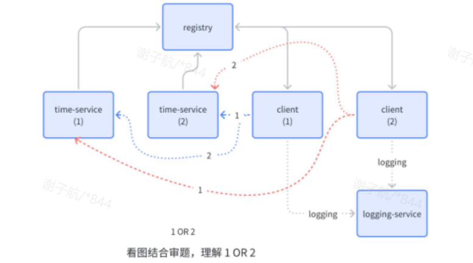

# 微服务架构项目 (MSA)

## 项目概述

本项目是一个基于Go语言开发的分布式微服务架构系统，实现了四个核心组件：**服务注册中心(Registry)**、**日志收集服务(Logging Service)**、**时间服务(Time Service)** 和 **客户端服务(Client)**。系统采用主从集群架构，支持高可用、服务发现、心跳监控和日志收集等功能。

### 功能特点
- 支持主从集群、服务注册与发现、健康检查、日志收集、时间服务等功能。
- 支持主从切换和故障转移，确保系统高可用。
- client支持对time-service的轮询调用，获取时间信息。

## 系统架构


## 四大核心功能详解

### 1. 服务注册中心 (Registry)

#### 功能概述
服务注册中心是整个微服务系统的核心，负责服务的注册、发现、健康检查和集群管理。采用主从架构，确保高可用性。

#### 主从集群实现

**1. 集群初始化**
```go
// 集群管理器启动时的逻辑
func (cm *ClusterManager) Start() {
    // 发现当前活跃主节点
    activeMaster := cm.discoverActiveMaster()
    if activeMaster != "" {
        cm.currentMaster = activeMaster
    } else {
        // 使用配置文件中的默认主节点
        cm.currentMaster = config.GetMasterAddr()
    }
    
    // 启动主节点健康检查
    go cm.monitorMaster()
}
```

**2. 主从同步机制**
- **写操作同步**: 主节点接收所有写操作(注册、注销、心跳)后，异步同步到所有从节点
- **故障转移**: 当主节点故障时，从节点自动提升为主节点
- **数据一致性**: 通过HTTP请求实现节点间数据同步

```go
// 主节点同步数据到从节点
func (cm *ClusterManager) SyncToSlaves(action string, instance storage.ServiceInstance) {
    slaveAddrs := config.GetSlaveAddrs()
    for _, slaveAddr := range slaveAddrs {
        go func(addr string) {
            err := cm.syncToSlave(addr, action, instance)
            if err != nil {
                log.Printf("同步到从节点 %s 失败: %v", addr, err)
            }
        }(slaveAddr)
    }
}
```

**3. 主从切换流程**
1. **健康检查**: 从节点定期检查主节点健康状态
2. **故障检测**: 连续失败时触发故障转移
3. **角色提升**: 从节点提升为主节点，开始清理任务
4. **状态通知**: 通过通道通知服务状态变化

```go
// 主节点状态监控
func (cm *ClusterManager) monitorMaster() {
    ticker := time.NewTicker(checkInterval)
    for range ticker.C {
        if !cm.isCurrentMasterHealthy() {
            cm.handleMasterFailure() // 处理主节点故障
        }
    }
}
```

#### 核心功能

**服务注册**
- 支持服务实例注册，记录服务名、ID、IP地址、端口
- 自动记录注册时间和GMT时间戳
- 主节点处理注册后同步到从节点

**服务发现**
- 支持按服务名查询所有健康实例
- 提供轮询负载均衡选择实例
- 返回实例详细信息包括心跳状态

**健康检查**
- 定期清理过期实例（默认60秒超时）
- 只有主节点执行清理任务，避免重复清理
- 支持配置化的心跳超时和清理间隔

### 2. 日志收集服务 (Logging Service)

#### 功能概述
统一的日志收集服务，接收各个微服务发送的日志信息，按时间顺序存储到本地文件。

#### 实现细节

**1. 日志接收接口**
```go
// 日志接收处理函数
func HandleLog(c *gin.Context) {
    var entry models.LogEntry
    
    // 参数验证
    if entry.ServiceName == "" {
        respondWithFieldError(c, "serviceName", entry)
        return
    }
    // ... 其他字段验证
    
    // 存储日志并排序
    logMutex.Lock()
    logs = append(logs, entry)
    writeSortedLogsToFile() // 按时间排序写入文件
    logMutex.Unlock()
}
```

**2. 日志存储机制**
- **并发安全**: 使用互斥锁保证并发写入安全
- **时间排序**: 每次写入都按datetime字段排序
- **文件存储**: 日志统一存储到 `log/log.txt` 文件

**3. 日志格式**
```
[2006-01-02 15:04:05.000] ServiceName: xxx ServiceId: xxx Level: info Message: xxx
```

#### 核心特性
- **统一收集**: 所有服务的日志集中收集
- **时间排序**: 自动按时间戳排序存储
- **参数验证**: 严格的参数格式验证
- **并发处理**: 支持多服务并发日志写入

### 3. 时间服务 (Time Service)

#### 功能概述
提供标准化的时间服务，支持多种时间格式输出，服务自动注册到注册中心并维持心跳。

#### 实现细节

**1. 时间格式支持**
```go
func HandlerGetDateTime(c *gin.Context) {
    style := c.Query("style")
    
    var result string
    switch style {
    case "full":
        result = time.Now().UTC().Format("2006-01-02 15:04:05")
    case "date":
        result = time.Now().UTC().Format("2006-01-02")
    case "time":
        result = time.Now().UTC().Format("15:04:05")
    case "unix":
        result = fmt.Sprintf("%d", time.Now().UTC().UnixMilli())
    }
}
```

**2. 服务注册与心跳**
```go
func main() {
    // 服务注册
    if err := register.Register(&config.Cfg); err != nil {
        log.Fatalf("服务注册失败: %v", err)
    }
    
    // 启动心跳维护
    go heartbeat.StartHeartbeat(&config.Cfg)
    
    // 优雅关闭时注销服务
    defer register.Unregister(&config.Cfg)
}
```

**3. 配置管理**
- 支持配置文件指定端口、服务ID等信息
- 自动获取本机IP地址进行注册
- 支持多实例部署(不同端口)

#### 核心特性
- **多格式输出**: 支持完整时间、日期、时间、Unix时间戳
- **GMT时间**: 统一使用GMT时间避免时区问题
- **自动注册**: 启动时自动注册到注册中心
- **心跳维护**: 定期发送心跳保持服务活跃状态
- **优雅关闭**: 关闭时自动注销服务

### 4. 客户端服务 (Client)

#### 功能概述
客户端服务是系统的入口点，集成了服务发现、时间获取、日志发送等功能，为用户提供统一的API接口。

#### 实现细节

**1. 服务发现与调用**
```go
func HandleGetInfo(c *gin.Context) {
    // 1. 服务发现 - 查找time-service实例
    for _, registryAddr := range config.Cfg.Registry.Addresses {
        discoveryURL := fmt.Sprintf("%s/api/discovery?name=time-service", registryAddr)
        resp, err := http.Get(discoveryURL)
        // ... 处理响应
    }
    
    // 2. 调用time-service获取时间
    for _, instance := range discovery.Data.Instances {
        timeURL := fmt.Sprintf("http://%s:%d/api/getDateTime?style=full", 
                              instance.IPAddress, instance.Port)
        timeResp, err := http.Get(timeURL)
        // ... 处理时间服务响应
    }
    
    // 3. 时间转换为北京时间
    beijingTime := parsedTime.In(time.FixedZone("CST", 8*3600))
    formatted := beijingTime.Format("2006-01-02 15:04:05")
}
```

**2. 日志收集客户端**
```go
func StartLoggingService(cfg *config.Config) {
    interval := time.Duration(cfg.Client.LoggingInterval) * time.Second
    
    // 定时发送日志
    ticker := time.NewTicker(interval)
    for range ticker.C {
        sendLog(cfg) // 发送状态日志到日志服务
    }
}
```

**3. 多注册中心支持**
- 支持配置多个注册中心地址
- 自动故障转移，尝试所有可用注册中心
- 确保服务发现的高可用性

#### 核心特性
- **服务编排**: 组合多个微服务功能
- **故障容错**: 支持多注册中心和多服务实例
- **时区转换**: GMT时间自动转换为北京时间
- **定时日志**: 定期发送健康状态日志
- **统一接口**: 为用户提供简单易用的API

## 接口调用说明

### 注册中心 API

**服务注册**
```bash
POST /api/register
Content-Type: application/json

{
    "serviceName": "time-service",
    "serviceId": "time-service-1",
    "ipAddress": "127.0.0.1",
    "port": 28200
}
```

**服务发现**
```bash
GET /api/discovery?name=time-service
```

**心跳维护**
```bash
POST /api/heartbeat
Content-Type: application/json

{
    "serviceId": "time-service-1"
}
```

### 时间服务 API

**获取时间**
```bash
GET /api/getDateTime?style=full    # 完整时间格式
GET /api/getDateTime?style=date    # 日期格式
GET /api/getDateTime?style=time    # 时间格式
GET /api/getDateTime?style=unix    # Unix时间戳
```

### 日志服务 API

**提交日志**
```bash
POST /api/loggingservice
Content-Type: application/json

{
    "serviceName": "client",
    "serviceId": "client-1",
    "datetime": "2006-01-02 15:04:05.000",
    "level": "info",
    "message": "Client status is OK."
}
```

### 客户端 API

**获取集成信息**
```bash
GET /api/getInfo
```

响应格式（支持time-service的轮询使用）：
```json
{
    "code": 200,
    "msg": "获取客户端时间成功",
    "data": {
        "result": "Hello Kingsoft Cloud Star Camp - client-1 - 2025-08-03 18:21:25",
        "clientServiceName": "client",
        "clientServiceId": "client-1",
        "clientIpAddress": "172.16.0.7",
        "clientPort": 28300,
        "timeServiceName": "time-service",
        "timeServiceId": "ts-2",
        "timeIpAddress": "172.16.0.7",
        "timePort": 28281
    }
}
```

## 部署和使用

### 1. 启动注册中心集群

```bash
# 启动主节点
cd registry
go run main.go -config ./config/registry-1.yaml

# 启动从节点
go run main.go -config ./config/registry-2.yaml
```

### 2. 启动日志服务

```bash
cd logging_service
go run main.go
```

### 3. 启动时间服务

```bash
cd time_service
go run main.go -config ./config/time-service-1.yaml
go run main.go -config ./config/time-service-2.yaml  # 多实例
```

### 4. 启动客户端服务

```bash
cd client
go run main.go -config ./config/client-1.yaml
```

### 5. 测试接口

```bash
# 测试客户端API
curl http://localhost:28300/api/getInfo

# 直接测试时间服务
curl "http://localhost:28200/api/getDateTime?style=full"

# 测试服务发现
curl "http://localhost:28180/api/discovery?name=time-service"
```

## 配置说明

### 注册中心配置 (registry-1.yaml)
```yaml
registry:
  port: 28180
  instanceId: registry-1
  cluster:
    - http://localhost:28180  # 主节点
    - http://localhost:28181  # 从节点
  heartbeat:
    timeoutSeconds: 60        # 心跳超时时间
    cleanupInterval: 9        # 清理检查间隔
    clusterCheckInterval: 10  # 集群检查间隔
```

### 时间服务配置 (time-service-1.yaml)
```yaml
service:
  serviceName: time-service
  serviceId: time-service-1
  ipAddress: 127.0.0.1
  port: 28200

registry:
  addresses:
    - http://localhost:28180
    - http://localhost:28181
```

### 客户端配置 (client-1.yaml)
```yaml
client:
  serviceName: client
  serviceId: client-1
  ipAddress: 127.0.0.1
  port: 28300
  loggingInterval: 30        # 日志发送间隔(秒)

registry:
  addresses:
    - http://localhost:28180
    - http://localhost:28181

logging:
  baseURL: http://localhost:28400

